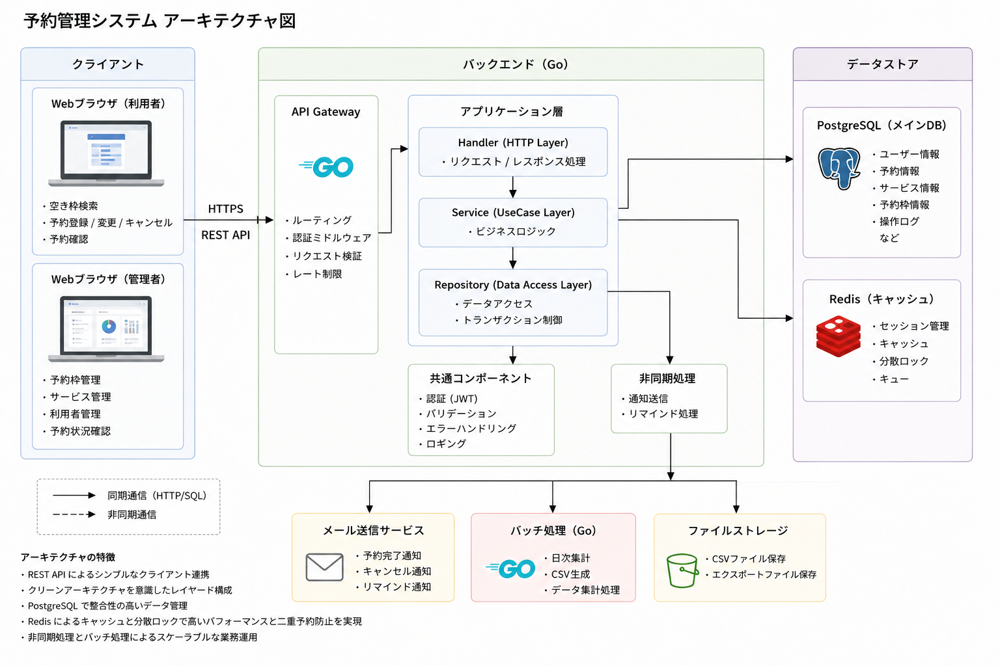
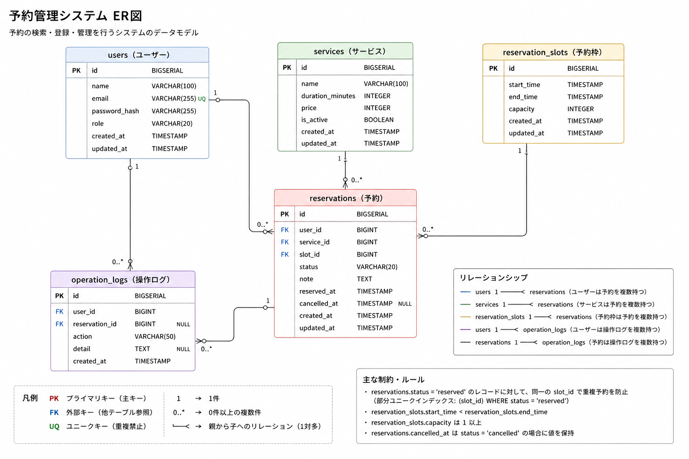

## 概要

本システムは、店舗・施設向けの予約管理システムです。

利用者はサービスの予約・変更・キャンセルを行い、
管理者は予約・サービス・予約枠を管理できます。

Go(Gin)によるREST APIと
React(TypeScript)によるSPAで構成しています。

実務を想定し、

- Repositoryパターン
- JWT認証
- トランザクション制御
- 二重予約防止
- Docker
- PostgreSQL

を採用しています。

## デモ

一般ユーザーでログインすると、予約済み・キャンセル済みの初期予約データを確認できます。

| 用途 | メールアドレス | パスワード |
|---|---|---|
| マイ予約一覧・詳細 | `user@example.com` | `userpass` |
| 所有者チェック確認 | `guest@example.com` | `guestpass` |
| 管理者 | `admin@example.com` | `adminpass` |

## 主な機能

### 利用者

- ログイン
- サービス検索
- 空き枠検索
- 予約登録
- 予約変更
- キャンセル

### 管理者

- ダッシュボード
- 予約管理
- サービス管理
- 予約枠管理
- CSV出力

## システム構成

本システムは、フロントエンドとバックエンドを分離したSPA（Single Page Application）構成を採用しています。

利用者・管理者はReactで構築したWeb画面へアクセスし、REST APIを介してバックエンド（Go + Gin）と通信します。

バックエンドでは業務ロジックをService層に集約し、Repositoryパターンによってデータアクセスを分離しています。
データはPostgreSQLに保存され、認証にはJWTを採用しています。

### アーキテクチャ



### システム構成図

```text
┌──────────────────────────────┐
│         Web Browser          │
│     (React + TypeScript)     │
└──────────────┬───────────────┘
               │ HTTPS / REST API
               ▼
┌──────────────────────────────┐
│        Go + Gin API          │
├──────────────────────────────┤
│           Handler            │
├──────────────────────────────┤
│           Service            │
├──────────────────────────────┤
│         Repository           │
└──────────────┬───────────────┘
               │
        PostgreSQL Driver
               │
               ▼
┌──────────────────────────────┐
│         PostgreSQL           │
└──────────────────────────────┘
```

### 採用アーキテクチャ

- **SPA（Single Page Application）**
- **REST API**
- **Layered Architecture**
- **Repository Pattern**
- **JWT Authentication**
- **Docker Compose**

### 各コンポーネントの役割

| コンポーネント | 役割 |
|---------------|------|
| React | 画面表示・ユーザー操作 |
| Gin | HTTPルーティング・API提供 |
| Handler | HTTPリクエスト／レスポンス処理 |
| Service | 業務ロジック・トランザクション制御 |
| Repository | データアクセス |
| PostgreSQL | データ永続化 |
| Docker Compose | 開発環境構築 |

### 採用理由

- **フロントエンドとバックエンドを分離**することで保守性・拡張性を向上
- **Repositoryパターン**により業務ロジックとデータアクセスを分離
- **Service層**でトランザクションを管理し、予約登録時のデータ整合性を保証
- **REST API**によりフロントエンドとの疎結合を実現
- **Docker Compose**により開発環境を容易に構築可能

## 技術スタック

| 分類 | 技術 |
|------|------|
| Backend | Go |
| Framework | Gin |
| Frontend | React |
| Language | TypeScript |
| Database | PostgreSQL |
| Cache | Redis |
| Authentication | JWT |
| API | REST |
| Container | Docker |
| CI | GitHub Actions |
| Documentation | Swagger |

## 主な機能

### 利用者

- ログイン
- 空き枠検索
- 予約登録
- 予約変更
- 予約キャンセル
- マイページ

### 管理者

- ダッシュボード
- 予約一覧
- サービス管理
- 予約枠管理
- CSV出力

## セットアップ

git clone

make setup

make up

make run

make frontend

## 起動方法

### Backend

http://localhost:8080

### Frontend

http://localhost:5173

### Swagger

http://localhost:8080/swagger/index.html

## API

### API仕様・一覧

本システムでは、Goで実装したREST APIを提供します。
認証にはJWTを使用し、一般利用者と管理者で利用可能なAPIを制御します。

#### 共通仕様

| 項目 | 内容 |
|---|---|
| Base URL | `/api/v1` |
| 認証方式 | JWT Bearer Token |
| Content-Type | `application/json` |
| 日時形式 | ISO 8601形式 |
| 文字コード | UTF-8 |

### 認証API

| メソッド | エンドポイント | 説明 | 認証 |
|---|---|---|---|
| POST | `/auth/register` | 利用者登録 | 不要 |
| POST | `/auth/login` | ログイン | 不要 |
| POST | `/auth/logout` | ログアウト | 必要 |
| GET | `/auth/me` | ログインユーザー情報取得 | 必要 |

### 利用者向けAPI

| メソッド | エンドポイント | 説明 | 認証 |
|---|---|---|---|
| GET | `/services` | サービス一覧取得 | 不要 |
| GET | `/reservation-slots` | 空き枠検索 | 不要 |
| POST | `/reservations` | 予約登録 | 必要 |
| GET | `/reservations` | 自分の予約一覧取得 | 必要 |
| GET | `/reservations/{reservationId}` | 予約詳細取得 | 必要 |
| PUT | `/reservations/{reservationId}` | 予約変更 | 必要 |
| DELETE | `/reservations/{reservationId}` | 予約キャンセル | 必要 |

### 管理者向けAPI

| メソッド | エンドポイント | 説明 | 認証 |
|---|---|---|---|
| GET | `/admin/reservations` | 全予約一覧取得 | 管理者 |
| GET | `/admin/reservations/{reservationId}` | 予約詳細取得 | 管理者 |
| PATCH | `/admin/reservations/{reservationId}/status` | 予約ステータス変更 | 管理者 |
| GET | `/admin/users` | 利用者一覧取得 | 管理者 |
| GET | `/admin/users/{userId}` | 利用者詳細取得 | 管理者 |
| POST | `/admin/services` | サービス登録 | 管理者 |
| PUT | `/admin/services/{serviceId}` | サービス更新 | 管理者 |
| DELETE | `/admin/services/{serviceId}` | サービス削除 | 管理者 |
| POST | `/admin/reservation-slots` | 予約枠登録 | 管理者 |
| PUT | `/admin/reservation-slots/{slotId}` | 予約枠更新 | 管理者 |
| DELETE | `/admin/reservation-slots/{slotId}` | 予約枠削除 | 管理者 |

### 集計・CSV API

| メソッド | エンドポイント | 説明 | 認証 |
|---|---|---|---|
| GET | `/admin/reports/daily` | 日次予約集計取得 | 管理者 |
| GET | `/admin/reports/daily/csv` | 日次予約集計CSV出力 | 管理者 |
| GET | `/admin/reservations/csv` | 予約一覧CSV出力 | 管理者 |

### 詳細

docs/api.md

## DB設計



### 詳細

docs/database.md

## システム設計

本システムでは

- Repositoryパターン
- Service層でのトランザクション管理
- JWT認証
- REST API設計
- Repository InterfaceによるDI

を採用しています。

## テスト

- Unit Test
- Integration Test

### 実行

make test

## テスト

- Unit Test
- Integration Test

### 実行

make test

## 今後の改善

- Redis導入
- メール送信
- Kubernetes対応
- GitHub Actions強化

## 設計書

- API設計
  docs/api.md
- DB設計
  docs/database.md
- クラス設計
  docs/class.md
- シーケンス図
  docs/images/sequence.md

詳細は docs を参照してください。
