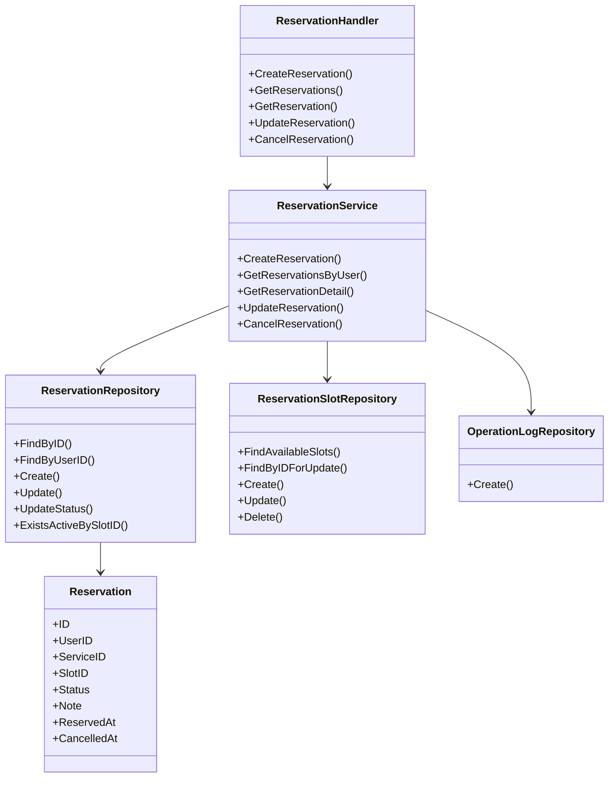

# クラス設計

## 1. 概要

本システムはGoによる予約管理システムであり、以下のレイヤ構成を採用する。

```text
Handler
  ↓
Service
  ↓
Repository
  ↓
Database
```

各レイヤの責務を分離し、保守性・テスト容易性を高める。

---

## 2. パッケージ構成

```text
.
├── cmd/
│   └── server/
│       └── main.go
├── internal/
│   ├── handler/
│   ├── service/
│   ├── repository/
│   ├── domain/
│   ├── dto/
│   ├── middleware/
│   ├── config/
│   └── database/
└── pkg/
    └── logger/
```

---

## 3. レイヤ責務

| レイヤ | 役割 |
|---|---|
| Handler | HTTPリクエスト受付、入力値取得、レスポンス返却 |
| Service | 業務ロジック、トランザクション制御 |
| Repository | DBアクセス、SQL実行 |
| Domain | 業務データ構造、状態管理 |
| DTO | Request / Response用構造体 |
| Middleware | 認証、認可、ログ出力 |
| Config | 環境変数、設定値管理 |

---

# 4. クラス構成図



---

# 5. 主要クラス詳細

## 5.1 ReservationHandler

### 役割

予約関連APIのHTTPリクエストを受け取り、Service層を呼び出す。

### 主な責務

- リクエストパラメータの取得
- Request DTOへの変換
- Service呼び出し
- HTTPレスポンス生成
- エラーレスポンス返却

### 主なメソッド

| メソッド | 概要 |
|---|---|
| CreateReservation | 予約登録API |
| GetReservations | ログインユーザーの予約一覧取得 |
| GetReservation | 予約詳細取得 |
| UpdateReservation | 予約変更 |
| CancelReservation | 予約キャンセル |

---

## 5.2 ReservationService

### 役割

予約に関する業務ロジックを担当する。

### 主な責務

- 予約可能チェック
- 二重予約チェック
- 予約登録・変更・キャンセル
- トランザクション制御
- 操作ログ登録

### 主なメソッド

| メソッド | 概要 |
|---|---|
| CreateReservation | 予約登録処理 |
| GetReservationsByUser | 利用者別予約一覧取得 |
| GetReservationDetail | 予約詳細取得 |
| UpdateReservation | 予約変更処理 |
| CancelReservation | 予約キャンセル処理 |

---

## 5.3 ReservationRepository

### 役割

reservationsテーブルへのDBアクセスを担当する。

### 主な責務

- 予約情報の取得
- 予約情報の登録
- 予約情報の更新
- ステータス変更
- 有効予約の存在確認

### 主なメソッド

| メソッド | 概要 |
|---|---|
| FindByID | 予約IDで取得 |
| FindByUserID | ユーザーIDで予約一覧取得 |
| Create | 予約登録 |
| Update | 予約情報更新 |
| UpdateStatus | 予約ステータス更新 |
| ExistsActiveBySlotID | 指定予約枠に有効予約が存在するか確認 |

---

## 5.4 ReservationSlotRepository

### 役割

reservation_slotsテーブルへのDBアクセスを担当する。

### 主な責務

- 空き枠検索
- 予約枠取得
- 予約枠登録・更新・削除
- 行ロック取得

### 主なメソッド

| メソッド | 概要 |
|---|---|
| FindAvailableSlots | 空き枠検索 |
| FindByID | 予約枠取得 |
| FindByIDForUpdate | 予約枠取得および行ロック |
| Create | 予約枠登録 |
| Update | 予約枠更新 |
| Delete | 予約枠削除 |

---

## 5.5 OperationLogRepository

### 役割

operation_logsテーブルへのDBアクセスを担当する。

### 主な責務

- 操作ログ登録
- 予約操作履歴の保存

### 主なメソッド

| メソッド | 概要 |
|---|---|
| Create | 操作ログ登録 |

---

# 6. Domain設計

## Reservation

| フィールド | 型 | 説明 |
|---|---|---|
| ID | int64 | 予約ID |
| UserID | int64 | 利用者ID |
| ServiceID | int64 | サービスID |
| SlotID | int64 | 予約枠ID |
| Status | ReservationStatus | 予約状態 |
| Note | string | 備考 |
| ReservedAt | time.Time | 予約日時 |
| CancelledAt | *time.Time | キャンセル日時 |
| CreatedAt | time.Time | 作成日時 |
| UpdatedAt | time.Time | 更新日時 |

### ReservationStatus

```go
type ReservationStatus string

const (
    ReservationStatusReserved  ReservationStatus = "reserved"
    ReservationStatusCancelled ReservationStatus = "cancelled"
    ReservationStatusCompleted ReservationStatus = "completed"
    ReservationStatusNoShow    ReservationStatus = "no_show"
)
```

---

## User

| フィールド | 型 | 説明 |
|---|---|---|
| ID | int64 | ユーザーID |
| Name | string | 氏名 |
| Email | string | メールアドレス |
| PasswordHash | string | パスワードハッシュ |
| Role | UserRole | 権限 |
| CreatedAt | time.Time | 作成日時 |
| UpdatedAt | time.Time | 更新日時 |

---

## Service

| フィールド | 型 | 説明 |
|---|---|---|
| ID | int64 | サービスID |
| Name | string | サービス名 |
| DurationMinutes | int | 所要時間 |
| Price | int | 料金 |
| IsActive | bool | 有効フラグ |
| CreatedAt | time.Time | 作成日時 |
| UpdatedAt | time.Time | 更新日時 |

---

## ReservationSlot

| フィールド | 型 | 説明 |
|---|---|---|
| ID | int64 | 予約枠ID |
| StartTime | time.Time | 開始日時 |
| EndTime | time.Time | 終了日時 |
| Capacity | int | 予約可能数 |
| CreatedAt | time.Time | 作成日時 |
| UpdatedAt | time.Time | 更新日時 |

---

# 7. DTO設計

## CreateReservationRequest

```go
type CreateReservationRequest struct {
    ServiceID int64  `json:"serviceId" validate:"required"`
    SlotID    int64  `json:"slotId" validate:"required"`
    Note      string `json:"note"`
}
```

## ReservationResponse

```go
type ReservationResponse struct {
    ReservationID int64     `json:"reservationId"`
    Status        string    `json:"status"`
    Service       ServiceDTO `json:"service"`
    StartTime     time.Time `json:"startTime"`
    EndTime       time.Time `json:"endTime"`
    ReservedAt    time.Time `json:"reservedAt"`
}
```

---

# 8. 予約登録処理の依存関係

```text
ReservationHandler.CreateReservation
    ↓
ReservationService.CreateReservation
    ↓
Transaction Begin
    ↓
ReservationSlotRepository.FindByIDForUpdate
    ↓
ReservationRepository.ExistsActiveBySlotID
    ↓
ReservationRepository.Create
    ↓
OperationLogRepository.Create
    ↓
Transaction Commit
```

---

# 9. 設計方針

## Handler層

Handler層では業務ロジックを持たない。  
HTTPリクエスト・レスポンスに関する処理のみを担当する。

## Service層

Service層では業務処理を担当する。  
予約登録やキャンセルなど、複数Repositoryをまたぐ処理はService層で制御する。

## Repository層

Repository層ではDBアクセスのみを担当する。  
SQLやトランザクション内で利用するクエリはRepositoryに集約する。

## Domain層

Domain層では業務上のデータ構造を定義する。  
状態値や業務ルールに関わる定数を集約する。

---

# 10. テスト方針

| 対象 | 内容 |
|---|---|
| Handler Test | リクエスト・レスポンスの検証 |
| Service Test | 業務ロジックの検証 |
| Repository Test | DBアクセスの検証 |
| Integration Test | APIからDBまでの結合確認 |

Service層はRepositoryをinterface化し、モックに差し替えることで単体テストを行いやすくする。