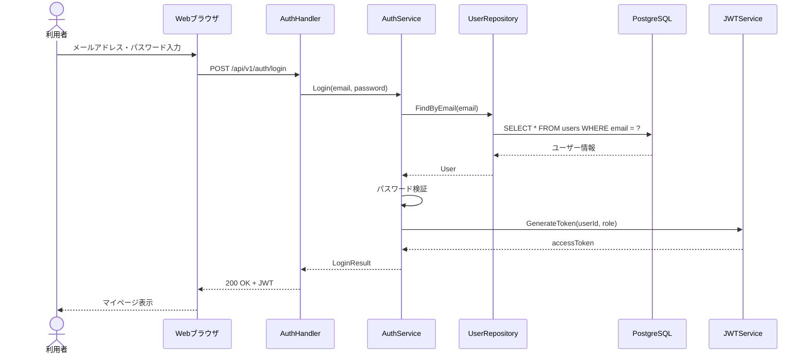
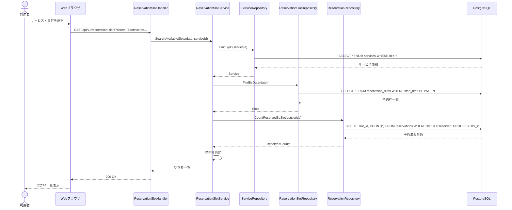
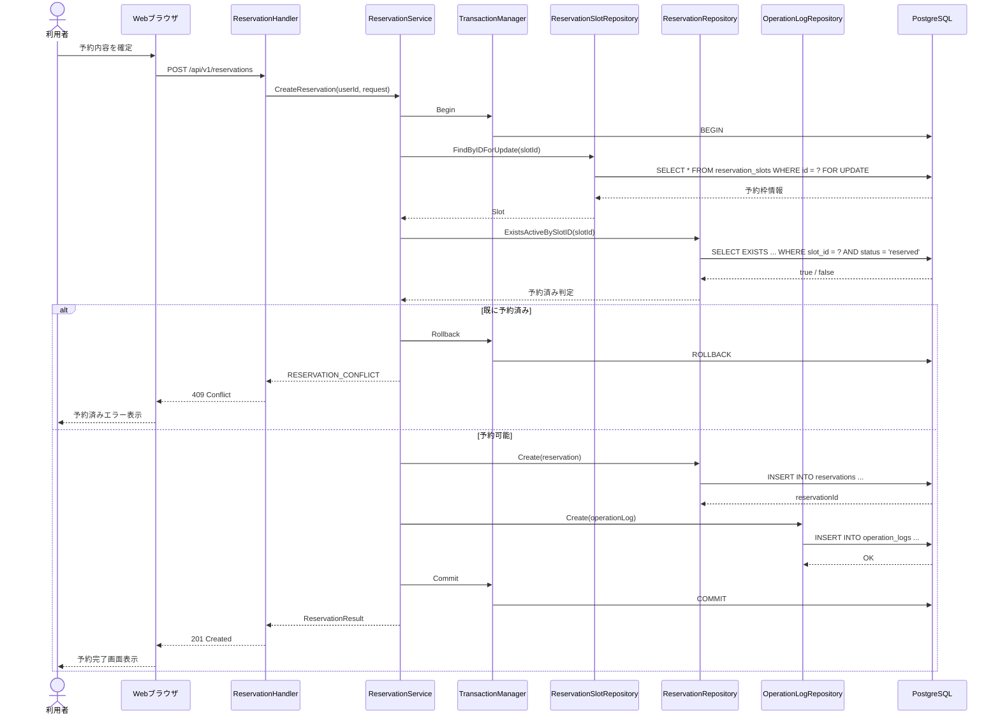
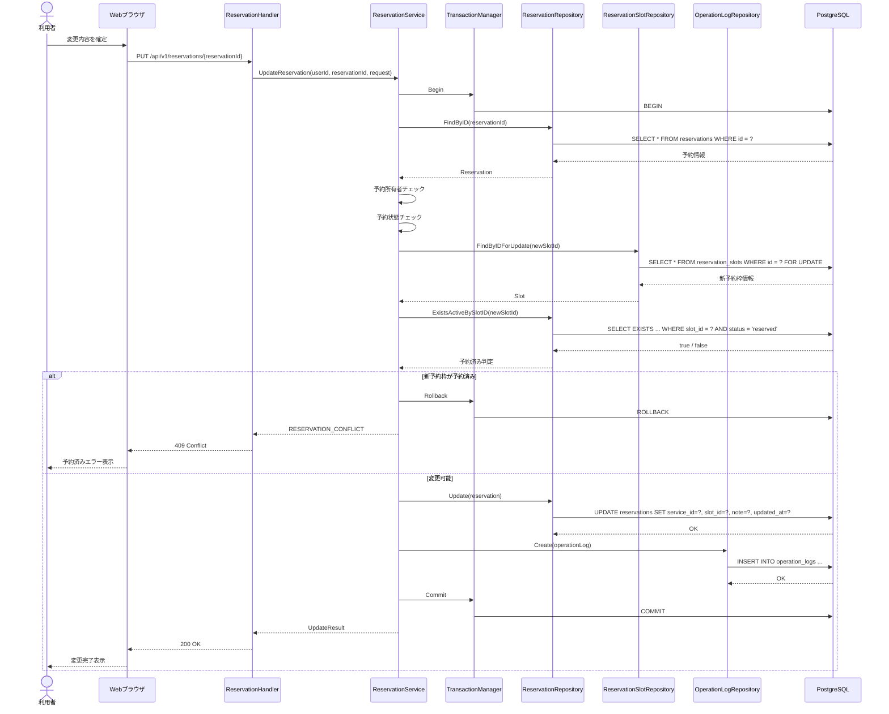
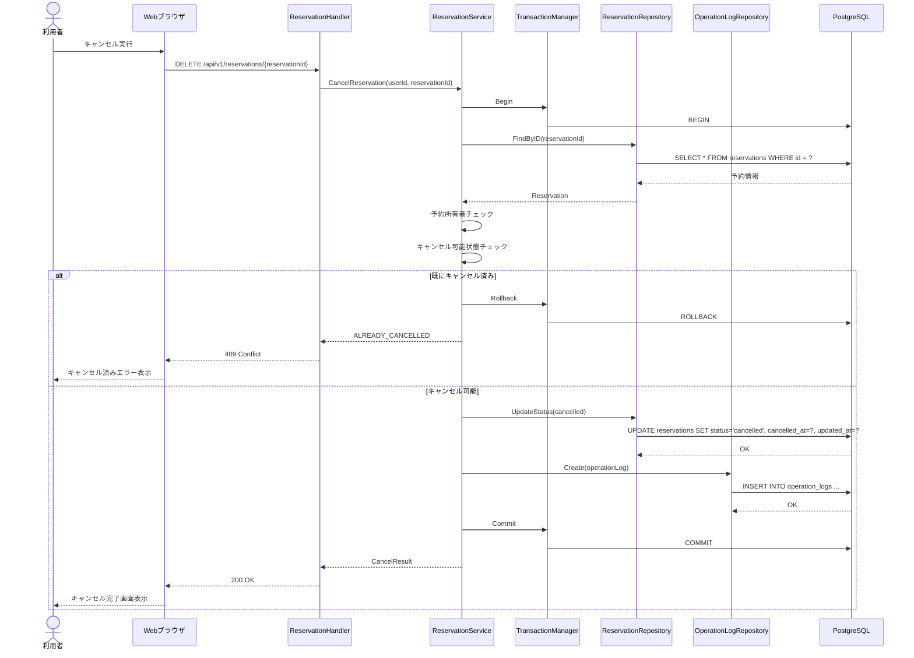
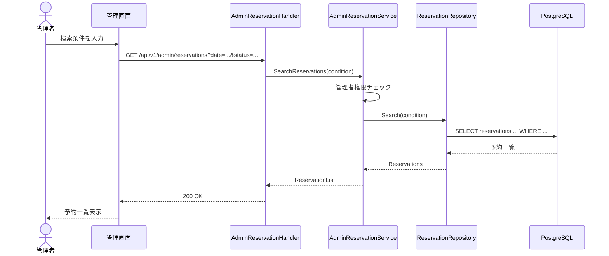
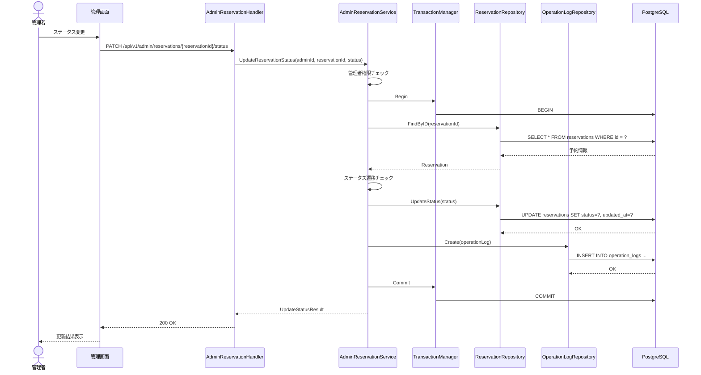
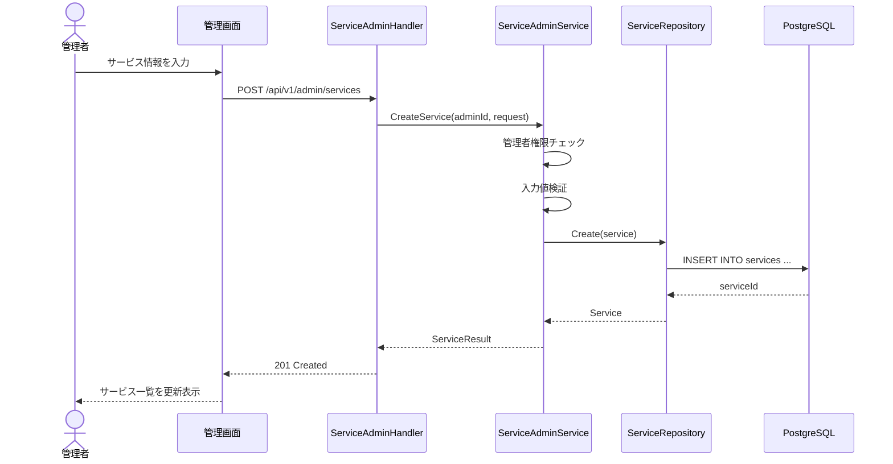
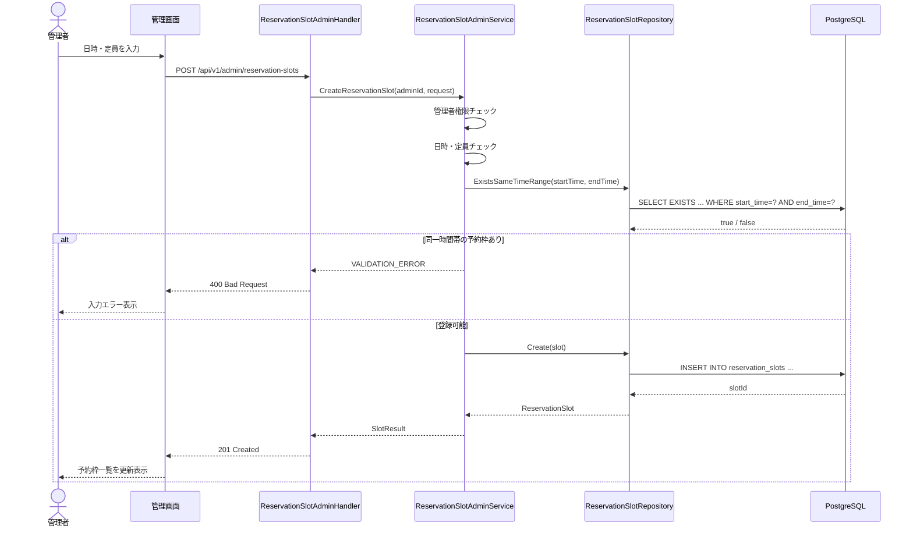
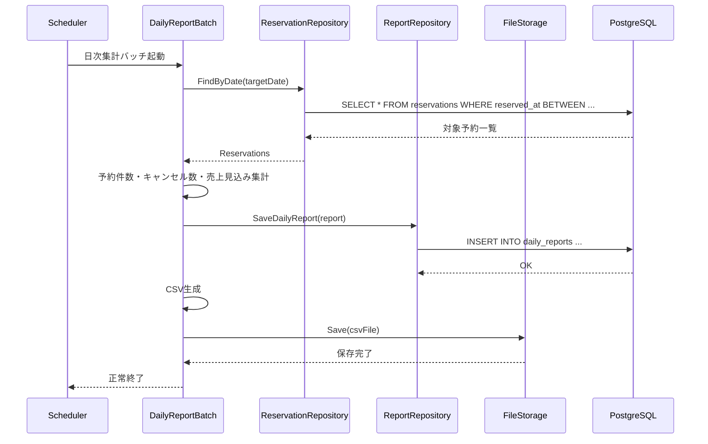

# シーケンス図

## 1. ログイン

---

## 2. 空き枠検索

---

## 3. 予約登録

---

## 4. 予約変更

---

## 5. 予約キャンセル

---

## 6. 管理者：予約一覧検索

---

## 7. 管理者：予約ステータス変更

---

## 8. 管理者：サービス登録・更新

---

## 9. 管理者：予約枠登録

---

## 10. 日次集計バッチ

